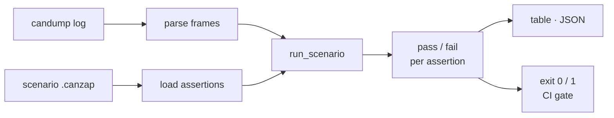

<a name="top"></a>
<div align="center">


# CANZAP

### Replay, fuzz, and assert on CAN bus traffic from a .pcap or SocketCAN interface with a tiny YAML DSL.


[](https://pypi.org/project/cognis-canzap/) [](https://github.com/cognis-digital/canzap/actions) [](LICENSE) [](https://github.com/cognis-digital)

*IoT / OT / Embedded — firmware, buses, and device security.*

</div>

```bash
pip install cognis-canzap
canzap scan .            # → prioritized findings in seconds
```


<!-- cognis:example:start -->
## 🔎 Example output

Real, reproducible output from the tool — runs offline:

```console
$ canzap-emit --version
canzap 0.1.0
```

```console
$ canzap-emit --help
usage: canzap [-h] [--version] [--format {table,json}] {check,dump} ...

Replay and assert on CAN bus traffic from a candump log.

positional arguments:
  {check,dump}
    check               assert a candump log against a scenario
    dump                parse/replay a candump log into frames

options:
  -h, --help            show this help message and exit
  --version             show program's version number and exit
  --format {table,json}
                        output format (default: table)

examples:
  canzap check --log capture.log --scenario startup.canzap
  canzap check --log capture.log --scenario s.canzap --format json
  canzap dump --log capture.log --format json
```

> Blocks above are real `canzap` output — reproduce them from a clone.

<!-- cognis:example:end -->

## Usage — step by step

1. **Install** the CLI (console script `canzap`):
   ```bash
   pip install cognis-canzap
   ```
2. **Replay a candump log into frames** to confirm parsing first:
   ```bash
   canzap dump --log capture.log
   ```
3. **Assert the log against a scenario** (`.canzap` file) — `check` exits non-zero on any failed assertion:
   ```bash
   canzap check --log capture.log --scenario startup.canzap
   ```
4. **Read the result** as JSON for pipelines (`--format` is a global flag; `-` reads stdin):
   ```bash
   canzap dump --log capture.log --format json
   cat capture.log | canzap check --log - --scenario startup.canzap --format json
   ```
5. **Automate in CI** — gate a build on bus assertions (non-zero exit fails the job):
   ```yaml
   - run: pip install cognis-canzap
   - run: canzap check --log capture.log --scenario startup.canzap --format json
   ```

## Contents

- [Why canzap?](#why) · [Features](#features) · [Quick start](#quick-start) · [Example](#example) · [Architecture](#architecture) · [Demos](#demos) · [AI stack](#ai-stack) · [How it compares](#how-it-compares) · [Integrations](#integrations) · [Install anywhere](#install-anywhere) · [Related](#related) · [Contributing](#contributing)

<a name="why"></a>
## Why canzap?

Automotive hacking made CI-friendly — write 'expect no arbitration-ID 0x7DF after lock' as a test, run it against a recorded drive log. Car-hacking demos are reliably viral on HN/Reddit.

`canzap` is single-purpose, scriptable, and self-hostable: point it at a target, get prioritized results in the format your workflow already speaks (table · JSON · SARIF), gate CI on it, and let agents drive it over MCP.

<div align="right"><a href="#top">↑ back to top</a></div>

<a name="features"></a>
## Features

- ✅ Parse Candump
- ✅ Parse Candump Text
- ✅ Load Scenario Text
- ✅ Load Scenario
- ✅ Run Scenario
- ✅ Result To Json
- ✅ Runs on Linux/macOS/Windows · Docker · devcontainer
- ✅ Ports in Python, JavaScript, Go, and Rust (`ports/`)

<div align="right"><a href="#top">↑ back to top</a></div>

<a name="quick-start"></a>
## Quick start

```bash
pip install cognis-canzap
canzap --version
canzap scan .                       # scan current project
canzap scan . --format json         # machine-readable
canzap scan . --fail-on high        # CI gate (non-zero exit)
```

<div align="right"><a href="#top">↑ back to top</a></div>

<a name="example"></a>
## Example

```text
$ canzap scan .
  [HIGH    ] CAN-001  example finding             (./src/app.py)
  [MEDIUM  ] CAN-002  another signal              (./config.yaml)

  2 findings · risk score 5 · 38ms
```

<div align="right"><a href="#top">↑ back to top</a></div>

<a name="architecture"></a>
## Architecture



See [`docs/ARCHITECTURE.md`](docs/ARCHITECTURE.md) for the full pipeline.

<div align="right"><a href="#top">↑ back to top</a></div>

<a name="demos"></a>
## Demos

Five runnable scenarios in [`demos/`](demos/), each for a different audience.
Every scenario replays a bundled candump capture fixture through the real
`canzap.core` API — fully offline, no CAN hardware — prints narrated output, and
exits 0, so they double as smoke tests.

```bash
PYTHONUTF8=1 python demos/run_all.py        # all five, end to end
PYTHONUTF8=1 python demos/03_red_team.py     # or just one
```

| # | Scenario | Audience | What it shows |
|---|----------|----------|---------------|
| 01 | `01_security_researcher.py` | Automotive security researchers | Enumerate the bus on a drive cycle, then lock in its invariants as a replayable baseline. |
| 02 | `02_ecu_engineer.py` | Embedded / ECU engineers | A periodic-frame timing contract (`max_period_ms`): PASS healthy, FAIL when a heartbeat is dropped. |
| 03 | `03_red_team.py` | Red teams | Prove a replay/fuzz landed (flood + injected UDS), then invert the rules into the blue team's gate. |
| 04 | `04_ir_forensics.py` | IR / forensics | Reconstruct an incident — replayed door-unlock burst + spoofed frame — and emit the verdict as JSON. |
| 05 | `05_bus_report.py` | Architects & reviewers | A one-screen bus map across all captures plus a green/red scenario roll-up. |

Full write-up and capture details in [`docs/DEMOS.md`](docs/DEMOS.md).

<div align="right"><a href="#top">↑ back to top</a></div>

<a name="ai-stack"></a>
## Use it from any AI stack

`canzap` is interoperable with every popular way of using AI:

- **MCP server** — `canzap mcp` (Claude Desktop, Cursor, Cognis.Studio, [uncensored-fleet](https://github.com/cognis-digital/uncensored-fleet))
- **OpenAI-compatible / JSON** — pipe `canzap scan . --format json` into any agent or LLM
- **LangChain · CrewAI · AutoGen · LlamaIndex** — wrap the CLI/JSON as a tool in one line
- **CI / scripts** — exit codes + SARIF for non-AI pipelines

<div align="right"><a href="#top">↑ back to top</a></div>

<a name="how-it-compares"></a>
## How it compares

| | **Cognis canzap** | caringcaribou + can-utils |
|---|:---:|:---:|
| Self-hostable, no account | ✅ | varies |
| Single command, zero config | ✅ | ⚠️ |
| JSON + SARIF for CI | ✅ | varies |
| MCP-native (AI agents) | ✅ | ❌ |
| Polyglot ports (JS/Go/Rust) | ✅ | ❌ |
| Open license | ✅ COCL | varies |

*Built in the spirit of **caringcaribou + can-utils**, re-framed the Cognis way. Missing a credit? Open a PR.*

<div align="right"><a href="#top">↑ back to top</a></div>

<a name="integrations"></a>
## Integrations

Pipes into your stack: **SARIF** for code-scanning, **JSON** for anything, an **MCP server** (`canzap mcp`) for AI agents, and a webhook forwarder for SIEM/Slack/Jira. See [`docs/INTEGRATIONS.md`](docs/INTEGRATIONS.md).

<div align="right"><a href="#top">↑ back to top</a></div>

<a name="install-anywhere"></a>
## Install — every way, every platform

```bash
pip install "git+https://github.com/cognis-digital/canzap.git"    # pip (works today)
pipx install "git+https://github.com/cognis-digital/canzap.git"   # isolated CLI
uv tool install "git+https://github.com/cognis-digital/canzap.git" # uv
pip install cognis-canzap                                          # PyPI (when published)
docker run --rm ghcr.io/cognis-digital/canzap:latest --help        # Docker
brew install cognis-digital/tap/canzap                             # Homebrew tap
curl -fsSL https://raw.githubusercontent.com/cognis-digital/canzap/main/install.sh | sh
```

| Linux | macOS | Windows | Docker | Cloud |
|---|---|---|---|---|
| `scripts/setup-linux.sh` | `scripts/setup-macos.sh` | `scripts/setup-windows.ps1` | `docker run ghcr.io/cognis-digital/canzap` | [DEPLOY.md](docs/DEPLOY.md) (AWS/Azure/GCP/k8s) |

<div align="right"><a href="#top">↑ back to top</a></div>

<a name="related"></a>
## Related Cognis tools

- [`fwxray`](https://github.com/cognis-digital/fwxray) — Diff two firmware images and surface exactly what changed: new binaries, flipped config flags, added certs, and shifted entropy regions.
- [`sbomb`](https://github.com/cognis-digital/sbomb) — Generate a CycloneDX SBOM directly from an unpacked firmware root filesystem and flag components with known CVEs and EOL kernels.
- [`mqttspy`](https://github.com/cognis-digital/mqttspy) — Passively map an MQTT broker: enumerate topics, detect unauthenticated writes, spot PII/secrets in payloads, and emit a risk report.
- [`uefiscan`](https://github.com/cognis-digital/uefiscan) — Audit UEFI firmware dumps for missing Secure Boot keys, unsigned modules, S3 boot-script vulns, and known SMM threats.
- [`modpot`](https://github.com/cognis-digital/modpot) — Spin up a high-interaction Modbus/DNP3 ICS honeypot that logs attacker register reads/writes as structured JSON.
- [`keyhunt`](https://github.com/cognis-digital/keyhunt) — Scan firmware blobs and filesystem dumps for hardcoded private keys, API tokens, default creds, and weak RSA/ECC material.

**Explore the suite →** [🗂️ all 170+ tools](https://github.com/cognis-digital/cognis-neural-suite) · [⭐ awesome-cognis](https://github.com/cognis-digital/awesome-cognis) · [🔗 cognis-sources](https://github.com/cognis-digital/cognis-sources) · [🤖 uncensored-fleet](https://github.com/cognis-digital/uncensored-fleet) · [🧠 engram](https://github.com/cognis-digital/engram)

<div align="right"><a href="#top">↑ back to top</a></div>

<a name="contributing"></a>
## Contributing

PRs, new rules, and demo scenarios are welcome under the collaboration-pull model — see [CONTRIBUTING.md](CONTRIBUTING.md) and [SECURITY.md](SECURITY.md).

> ### ⭐ If `canzap` saved you time, **star it** — it genuinely helps others find it.

## Interoperability

`{}` composes with the 300+ tool Cognis suite — JSON in/out and a shared
OpenAI-compatible `/v1` backbone. See **[INTEROP.md](INTEROP.md)** for the
suite map, composition patterns, and reference stacks.

## License

Source-available under the **Cognis Open Collaboration License (COCL) v1.0** — free for personal, internal-evaluation, research, and educational use; **commercial / production use requires a license** (licensing@cognis.digital). See [LICENSE](LICENSE).

---

<div align="center"><sub><b><a href="https://cognis.digital">Cognis Digital</a></b> · one of 170+ tools in the <a href="https://github.com/cognis-digital/cognis-neural-suite">Cognis Neural Suite</a> · <i>Making Tomorrow Better Today</i></sub></div>
