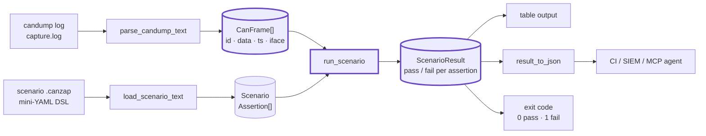

# CANZAP — Architecture

`canzap` replays a recorded CAN bus capture and asserts declarative checks
against it. It is a small, dependency-free pipeline: a candump log and a
scenario file go in, a pass/fail result (table or JSON, with a non-zero exit on
failure) comes out. Everything runs offline against a recorded capture — no
SocketCAN interface and no live hardware are required.

## The pipeline

## Components

### Frame parser (`parse_candump`, `parse_candump_text`)
Parses the standard `candump -l` log format,
`(<epoch.usec>) <iface> <CANID>#<HEXDATA>`, into `CanFrame` records. It accepts
both the timestamped log form and the plain console form, detects extended
(29-bit) IDs from the ID width, validates hex/length (rejecting odd-length data
and frames over the 64-byte CAN FD maximum), and skips blank and `#` comment
lines. A malformed frame raises `ValueError` with the line number.

### Frame model (`CanFrame`)
A dataclass: `timestamp`, `interface`, `can_id`, `data` (bytes), `extended`,
plus a derived `dlc` and a `to_dict()` for JSON. This is the single unit the
rest of the engine reasons over.

### Scenario DSL (`load_scenario`, `load_scenario_text`)
A deliberately tiny YAML subset (so there is no PyYAML dependency): a top-level
`name:` and an `assertions:` list of `- key: value` blocks. Each block becomes
one `Assertion`. Supported predicates:

| key | meaning |
|---|---|
| `present` | the ID must (`true`) / must not (`false`) appear |
| `min_count` / `max_count` | bound how many frames carry the ID |
| `byte` + `equals` | the last matching frame's byte *N* equals a value |
| `data_equals` | the last matching frame's full payload equals a hex string |
| `max_period_ms` | no gap between consecutive frames exceeds a deadline |
| `interface` | scope the assertion to one bus interface |

### Evaluator (`run_scenario`, `_eval_assertion`)
For each assertion it selects the matching frames (by `can_id`, optionally by
`interface`), then applies the predicates above and returns an `AssertResult`
with `passed`, a human-readable `detail`, and an `observed` dict (count, byte
value, worst period…). `ScenarioResult` aggregates them: `.passed` is true only
when every assertion passes, and `.failures` lists the rest.

### CLI (`canzap.cli`)
Two subcommands over the same engine: `dump` replays a log into frames
(table/JSON, always exits 0), and `check` runs a scenario and **exits 1 on any
failed assertion** — the CI gate. `--format json` and `-` (stdin) make it
pipeline-friendly. `result_to_json` is the shared JSON serializer.

### MCP server (`canzap.mcp_server`)
Exposes the same operations to AI agents over MCP, so an agent can replay a
capture and assert on it as a tool call.

## Why these choices

- **No dependencies.** Pure standard library — the log parser is a regex and
  the DSL is a hand-written line parser, so `pip install` pulls in nothing.
- **Offline and deterministic.** A capture file replays to the same verdict
  every time, which is what makes a CAN assertion usable as a regression test.
- **Exit code is the contract.** `check` returns 0/1; that single fact wires the
  tool into any CI system or shell pipeline without parsing output.
